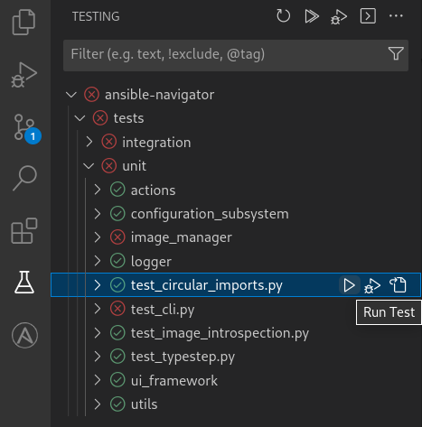

# Contributing to Ansible Navigator

Some background:

The ansible-navigator code base is not just for it's users but current and
future developers. Over time we have adopted a few tools that help us maintain
it and you contribute.

1.  mypy (Helps with type checking)

2.  pylint (lints all the things)

3.  code-spell (prevents typos in code)

4.  isort (sorts import statements)

!!! notice

    In early development cycles, a decision was made to use black as a formatter
    which is why current pull-requests are required to pass a
    `black --diff` check of the source tree. The decision to use `black` is
    left to individual developers as the formatting changes it makes can be
    achieved without it.

Details can be found below on how to run these manually, our CI will also check
them for you.

In order to contribute, you'll need to:

1.  Fork the repository.

2.  Create a branch, push your changes there.

3.  Send it to us as a PR.

4.  Iterate on your PR, incorporating the requested improvements and
    participating in the discussions.

Prerequisites:

1.  Have {doc}`tox <tox:index>`.

2.  Use {doc}`tox <tox:index>` to run the tests.

3.  Before sending a PR, make sure that `lint` passes:

    ```shell-session
    $ tox -e lint
    lint create: .tox/lint
    lint installdeps: .[test]
    lint installed: ...
    lint run-test-pre: PYTHONHASHSEED='4242713142'
    lint run-test: commands[0] | pylint ansible_navigator tests ...
    ...
    _________________________________ summary __________________________________
    lint: commands succeeded
    congratulations :)
    ```

!!! notice

    Because the version of python is pinned to a specific version to ensure the
    outcome of running `tox -e lint` locally is the same as `tox -e lint` being run
    by github actions, you may see the following error: `RuntimeError: failed to
    find interpreter for Builtin discover of python_spec='python3.XX'`. This
    indicates the version of python that needs to be installed for tox to run
    locally. In this case, the version of python that needs to be installed is

## Getting started with Ansible Navigator

### Building from the source and installing packages for testing

After cloning the repository, create and activate a new [virtual environment] in
the root of the repository. Once that is done all we need is to install
ansible-navigator from the source. Use the following command in workspace (root
folder of navigator).This will install package in editable/development mode,
along with its additional dependencies required for testing.

```shell-session
pip install -e .\[test]
```

[virtual environment]: https://docs.python.org/3/library/venv.html

### Testing process and examples

Once all the dependencies are installed, we can execute our tests using
[pytest]. To run tests inside a file test_xyz.py, we will need to traverse to
that file.

[pytest]: https://docs.pytest.org/en/7.3.x/

Example: To run an unit test "test_circular_imports.py", we will execute:

`pytest tests/unit/test_circular_imports.py`

Example: To run an integration test "test_stdout_vault.py ", we will execute:

`pytest tests/integration/actions/exec/test_stdout_vault.py`

and so on ...

Additionally, leverage the ability of VSCode test tree to run and debug tests in
a more easier and interactive way. There is a dedicated configuration provided
inside launch.json named as **Debug tests** to interactively debug the tests
through VSCode test tree.

Hover to the **Testing** icon in the Activity Bar to see VSCode test tree. From
there expand and reach to the desired unit or integration test and hit
`Run Test` or `Debug Test` appropriately.



### Configure VSCode settings

Once we are inside vscode with project installed, we should see a `.vscode`
folder in our workspace. Having a launch configuration file is beneficial
because it allow us to configure and save debugging setup details. VS Code keeps
debugging configuration information in a `launch.json` file located in a
`.vscode` folder in our workspace (project root folder).

Similarly, The workspace settings file `settings.json` is also located under the
`.vscode` folder in our root folder. These are the project specific settings
shared by all users of that project.

Use the existing settings or drop in the required changes in configuration of
these `launch.json` and `settings.json` files.

Now, the final steps!

- Put breakpoint(s) in the code where needed.
- Hover to the **Run and Debug** icon in the Activity Bar to start the debugger.

At this point, the debugger should hit your breakpoint and start the debugging
session.

### Debug Ansible-Navigator Subcommands

Ansible-Navigator comes in with bunch of [sub-commands]. To debug around any
specific subcommand, we will need to add `args` attribute (arguments passed to
the program to debug) in our launch.json configuration file.

[sub-commands]: https://ansible-navigator.readthedocs.io/subcommands/

**Example:**

- Debug `ansible-navigator run` subcommand, use _args_ attribute, provide
  absolute path to the playbook as mentioned. Following configuration will allow
  to debug `ansible-navigator site.yml --mode stdout`.

```json
{
  "version": "0.2.0",
  "configurations": [
    {
      "name": "Debug subcommand: run",
      "type": "python",
      "request": "launch",
      "module": "ansible_navigator",
      "args": ["run", "../Path/to/Playbook/site.yml", "--mode", "stdout"],
      "cwd": "${workspaceFolder}/src",
      "justMyCode": false
    }
  ]
}
```

- Debug `ansible-navigator exec` subcommand using _args_ with some parameter.
  Following configuration will allow to debug `ansible-navigator exec -- pwd`.

```json
{
  "version": "0.2.0",
  "configurations": [
     {
      "name": "Debug subcommand: exec",
      "type": "python",
      "request": "launch",
      "module": "ansible_navigator",
      "args": ["exec", "--", "pwd"],
      "cwd": "${workspaceFolder}/src",
      "justMyCode": false
    }
}
```

- To debug subcommand `ansible-navigator images`, add one more attribute as
  `"args": ["images"]` in our previously configured launch.json.
- To debug subcommand `ansible-navigator collections`, add one more attribute as
  `"args": ["collections"]` in launch.json, and so on.
- Moreover, to debug subcommands with some parameter use
  `"args": ["subcommand-name", "--", "parameter"]`
- While debugging any subcommand with arguments, make sure to use one _args_
  entry at a time in our configuration (comment/remove the ones not in use).

### Useful Links

- VS code debugging [guide].
- Facilitate [Python Debugger] (pdb) in navigator for pure command line
  debugging.

[guide]: https://code.visualstudio.com/docs/editor/debugging
[python debugger]: https://www.geeksforgeeks.org/python-debugger-python-pdb/

## Contributing docs

We use [mkdocs](https://www.mkdocs.org/) to generate our docs website. You can
trigger the process locally by executing:

<!-- cspell:disable -->

```shell
$ tox -e docs
...
```

It is also integrated with [Read The Docs](https://readthedocs.org/) that builds
and publishes each commit to the main branch and generates live docs previews
for each pull request.
